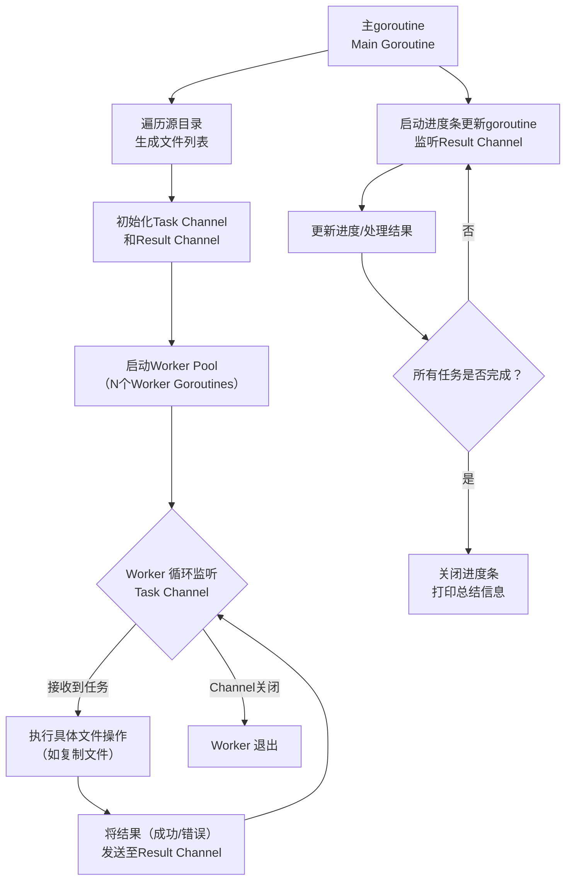

**高并发文件批量处理工具**

# 实训项目：高并发文件批量处理工具
## 详细技术方案与开发流程

## 1. 项目概述

### 1.1 项目背景与目标
开发一个基于Go语言的命令行工具，用于高性能、高可靠地批量处理文件（如复制、移动、重命名、校验等）。核心目标是**深入理解并实践Go语言的并发编程模型**（goroutine, channel, sync包），掌握在I/O密集型任务中利用并发显著提升性能的方法。

### 1.2 核心需求
1.  **基本功能**：支持复制、移动、重命名（添加前缀/后缀/替换字符串）、计算文件MD5/SHA256校验和。
2.  **并发处理**：必须使用goroutine池（Worker Pool）模式并发处理文件，并发度（worker数量）可由用户指定。
3.  **可靠性**：能正确处理并报告错误（如文件不存在、权限不足、磁盘空间不足等）。
4.  **用户交互**：提供清晰的命令行界面，支持进度条显示和详细日志模式。
5.  **安全性**：在进行覆盖操作（如覆盖已存在文件）前，可提供确认提示。

## 2. 技术栈

*   **语言**: Go 1.21+
*   **核心包**:
    *   `os`, `io`, `path/filepath`: 文件与路径操作
    *   `sync` (WaitGroup, Mutex): 并发同步
    *   `context`: 任务取消与超时控制
    *   `flag` 或 `github.com/spf13/cobra`: 命令行参数解析 (推荐cobra，更强大)
    *   `crypto/md5`, `crypto/sha256`: 计算哈希校验和
*   **第三方库**:
    *   `github.com/cheggaaa/pb/v3`: 在终端显示进度条
    *   `github.com/fatih/color`: 终端输出着色（可选，提升可读性）

## 3. 系统架构与核心设计

### 3.1 并发模型：Worker Pool (Goroutine池)
这是项目的核心设计，能有效控制并发量，防止无限制创建goroutine导致资源耗尽。



**流程说明**：
1.  **主线程（Main Goroutine）**：
    *   解析命令行参数。
    *   遍历源目录，收集所有需要处理的文件路径，生成任务列表。
    *   创建两个关键Channel：`tasks`（带缓冲，用于分发任务）和 `results`（用于接收结果）。
    *   根据用户指定的 `-workers` 参数，启动相应数量的 **Worker Goroutine**。
    *   将收集到的文件任务（包含源路径和目标路径等信息）发送到 `tasks` channel。
    *   启动一个监听 `results` channel 的循环，用于收集处理结果、更新进度条和处理错误。
    *   最后关闭channel，等待所有worker退出，并打印总结。

2.  **工作线程（Worker Goroutine）**：
    *   每个Worker都是一个独立的goroutine。
    *   它们通过 `for range` 循环从 `tasks` channel 中持续读取任务。
    *   一旦拿到任务，就执行具体的文件操作（如 `copyFile(src, dst)`）。
    *   操作完成后，将结果（成功或包含错误信息）发送到 `results` channel。
    *   当 `tasks` channel 被主goroutine关闭且其中的任务已被取空时，`for range` 循环结束，Worker自动退出。

### 3.2 关键数据结构
```go
// Task 代表一个需要被处理的文件任务
type Task struct {
    SourcePath string
    DestPath   string
    OpType     string // "copy", "move", "checksum", etc.
}

// Result 代表一个任务的处理结果
type Result struct {
    Task    Task
    Success bool
    Message string // 成功信息或错误详情
    Error   error
}
```

## 4. 开发流程（四周计划）

### 第一周：项目准备与基础功能开发
*   **Day 1-2**: 学习巩固Go基础语法、并发基础（goroutine, channel, WaitGroup）。搭建开发环境。
*   **Day 3-4**: 使用 `cobra` 库搭建命令行框架，实现基本命令结构（如 `tool copy [flags] <source> <dest>`）。
*   **Day 5**: **同步顺序版本**：实现最基础的单线程文件复制功能。这是重要的基准和调试基础。
*   **目标**：完成一个可以运行的（但未并发的）命令行工具。

### 第二周：并发核心实现
*   **Day 6-8**: **实现Worker Pool模型**。编写启动Worker、创建Channel的代码。让Worker只是打印接收到的任务，暂不执行真实操作。
*   **Day 9-10**: **实现核心文件操作函数**。在Worker中调用 `copyFile` 函数。注意使用 `os.Open`、`os.Create`、`io.Copy` 来实现。**重点处理错误和文件关闭（defer）**。
*   **Day 11-12**: **实现并发流程闭环**。主goroutine监听 `results` channel，收集结果。使用 `sync.WaitGroup` 确保所有Worker完成后程序再退出。
*   **目标**：完成一个能正确进行**并发复制**的工具原型。

### 第三周：功能完善与优化
*   **Day 13-14**: **集成进度条**。使用 `pb` 库，根据总任务数和已完成任务数实时显示进度。
*   **Day 15-16**: **增强错误处理**。集中收集和处理错误，并在最终总结中报告。实现遇到错误时是继续（`-skip-error`）还是中止的逻辑。
*   **Day 17-18**: **扩展更多功能**：实现移动（先复制再删除原文件）、重命名（逻辑处理）、计算校验和等功能。
*   **目标**：工具的功能和用户体验基本成型。

### 第四周：测试、调试与交付
*   **Day 19**: **编写测试用例**。针对工具函数（如路径计算、重命名逻辑）编写单元测试。使用临时目录进行集成测试。
*   **Day 20**: **性能测试与对比**。使用 `time` 命令对比同步版本和并发版本处理大量小文件和一个大文件的性能差异，并分析原因。
*   **Day 21-22**: **代码优化与整理**：编写清晰的注释，优化代码结构，完成所有拓展功能（如递归目录处理）。
*   **Day 23**: **撰写项目文档**（README.md），包括功能说明、安装方式、使用示例。
*   **Day 24**: **项目演示与验收**。
*   **目标**：交付一个功能完整、代码规范、文档清晰的成品。

## 5. 其他

1.  **资源耗尽**：处理大量文件时，如果一次性打开太多文件描述符，可能导致系统限制。**解决方案**：控制Worker数量，并在每个文件操作后及时调用 `Close()`。
2.  **错误处理复杂性**：并发下的错误处理比顺序程序更复杂。**解决方案**：使用统一的Result channel传递错误，在主线程中集中处理，保持逻辑清晰。
3.  **进度更新竞态条件**：多个Worker同时更新进度计数器可能导致数据竞争。**解决方案**：使用 `sync/atomic` 包进行原子操作，或将所有进度更新都通过唯一的channel进行。
4.  **符号链接处理**：决定是复制链接本身还是链接指向的实际文件。**解决方案**：使用 `filepath.WalkDir` 并提供相应的遍历逻辑，或在功能中明确说明。
