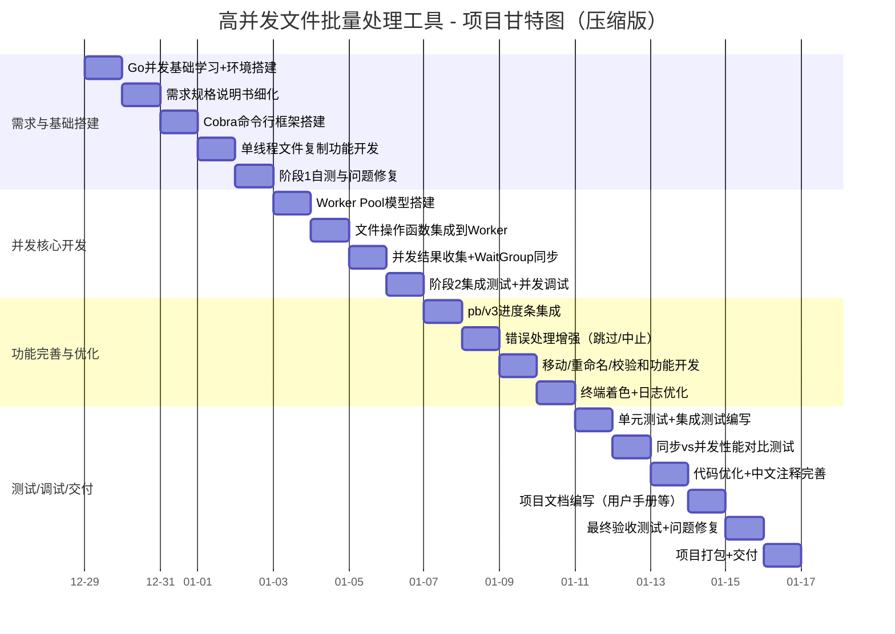

# 高并发文件批量处理工具 - 项目计划

## 文档说明

---

## 1. 项目基本信息

### 1.1 项目名称

高并发文件批量处理工具（Go语言实现）

### 1.2 项目背景与目标

本项目为校内软件项目开发实践实训任务，核心目标是：

- 深入实践Go语言并发编程模型（goroutine、channel、sync包）；
- 开发高性能、高可靠的命令行文件批量处理工具，支持复制、移动、重命名、哈希校验等核心功能；
- 基于Worker Pool模式实现可控并发，解决I/O密集型任务的性能瓶颈；
- 满足考核要求的文档规范、代码质量及交付标准。

### 1.3 项目范围

#### 1.3.1 功能范围（核心）

| 功能模块     | 具体能力                                                     |
| ------------ | ------------------------------------------------------------ |
| 基础文件操作 | 复制、移动、重命名（前缀/后缀/字符串替换）、MD5/SHA256校验和计算 |
| 并发控制     | 支持用户自定义Worker数量，基于Worker Pool分发任务，避免无限制goroutine创建 |
| 交互体验     | 命令行参数解析、实时进度条、终端着色日志、覆盖操作确认提示   |
| 可靠性保障   | 捕获并报告文件不存在、权限不足、磁盘空间不足等错误，支持“跳过错误/中止任务”逻辑 |

#### 1.3.2 非功能范围

- 不支持分布式文件处理、图形化界面；
- 不处理TB级超大文件的分片传输（聚焦常规文件批量处理场景）；
- 不兼容非主流操作系统（仅支持Windows/Linux/macOS主流版本）。

---

## 2. 项目团队与资源分配

### 2.1 团队成员分工（3 人小组）

| 角色                      | 姓名   | 核心职责                                                     | 工作量占比 | 交付物关联考核项                                   |
| ------------------------- | ------ | ------------------------------------------------------------ | ---------- | -------------------------------------------------- |
| 项目负责人 / 并发核心开发 | 成员 1 | 进度把控、里程碑验收、Worker Pool 模型实现、Channel 设计、sync 包同步逻辑开发 | 40%        | 项目计划、系统设计文档、开发进度报告、源代码       |
| 文件操作 / 交互层开发     | 成员 2 | 复制 / 移动 / 重命名 / 校验和核心函数、Cobra 命令行解析、进度条 / 终端着色集成 | 35%        | 需求规格说明书、用户手册、测试计划、源代码         |
| 测试与文档 / 辅助开发     | 成员 3 | 测试用例编写、性能测试、全量文档整理、代码注释审核、日志输出优化 | 25%        | 测试报告、代码审查报告、所有交付文档汇总、操作手册 |

### 2.2 资源清单

#### 2.2.1 硬件资源

| 资源类型 | 配置要求                      | 数量 | 用途                     |
| -------- | ----------------------------- | ---- | ------------------------ |
| 开发主机 | CPU i5/i7、8G+内存、500G+磁盘 | 3台  | 代码开发、本地功能测试   |
| 测试主机 | 同开发主机配置                | 1台  | 集中性能测试、兼容性验证 |
| 存储介质 | 128G+ U盘/移动硬盘            | 1个  | 测试文件存储、数据备份   |

#### 2.2.2 软件资源（均为开源免费）

| 工具/库名称 | 版本/说明                                       | 用途            |
| ----------- | ----------------------------------------------- | --------------- |
| Go环境      | 1.21+                                           | 核心开发语言    |
| 开发编辑器  | VS Code（Go插件）/Goland                        | 代码编写、调试  |
| 第三方库    | cobra（命令行）、pb/v3（进度条）、color（着色） | 交互层实现      |
| 版本控制    | Git + Gitee/GitHub                              | 代码版本管理    |
| 文档工具    | Markdown编辑器、Word、Mermaid在线工具           | 文档/流程图编写 |

## 3. 项目时间表（12天：2025-12-29 ~ 2026-01-09）

### 3.1 阶段划分与任务拆解

| 阶段           | 时间范围                | 核心任务（压缩后）                                           | 交付物                         |
| -------------- | ----------------------- | ------------------------------------------------------------ | ------------------------------ |
| 需求与基础搭建 | 2025-12-29 ~ 2026-01-01 | Go并发快速学习、需求最终确认、Cobra框架搭建、单线程文件复制/基础错误处理开发 | 基础命令行框架、单线程功能原型 |
| 并发核心开发   | 2026-01-02 ~ 2026-01-03 | Worker Pool模型实现、文件操作集成、Result Channel结果收集、WaitGroup同步、并发功能调试 | 并发复制功能原型               |
| 功能完善与优化 | 2026-01-04 ~ 2026-01-06 | 进度条集成、错误处理增强（跳过/中止）、移动/重命名/校验和功能开发、终端着色/日志优化 | 全功能版本                     |
| 测试/调试/交付 | 2026-01-07 ~ 2026-01-09 | 单元测试/集成测试、同步vs并发性能对比测试、代码优化/注释完善、全量文档整理、最终验收/打包交付 | 测试报告、成品代码、全量文档   |

### 3.2 详细任务时间轴

| 任务ID | 任务名称                   | 负责人  | 开始时间   | 结束时间   | 依赖项      | 验收标准                                     |
| ------ | -------------------------- | ------- | ---------- | ---------- | ----------- | -------------------------------------------- |
| T1-01  | Go并发基础学习+环境搭建    | 全体    | 2025-12-29 | 2025-12-29 | 无          | 全员掌握goroutine/channel核心，开发环境就绪  |
| T1-02  | 需求规格说明书细化         | 成员1   | 2025-12-29 | 2025-12-30 | T1-01       | 明确所有功能点、验收标准                     |
| T1-03  | Cobra命令行框架搭建        | 成员4   | 2025-12-30 | 2025-12-31 | T1-02       | 支持基础命令（如`tool copy`）参数解析        |
| T1-04  | 单线程文件复制功能开发     | 成员3   | 2025-12-31 | 2026-01-01 | T1-03       | 能正确复制单个/多个文件，捕获基础错误        |
| T1-05  | 阶段1自测与问题修复        | 全体    | 2026-01-01 | 2026-01-01 | T1-01~T1-04 | 单线程版本可稳定运行                         |
| T2-01  | Worker Pool模型搭建        | 成员2   | 2026-01-02 | 2026-01-02 | T1-05       | 任务分发/接收逻辑正常，支持自定义Worker数    |
| T2-02  | 文件操作集成到Worker       | 成员3   | 2026-01-02 | 2026-01-03 | T2-01       | Worker可执行文件复制，结果写入Result Channel |
| T2-03  | 并发结果收集+WaitGroup同步 | 成员2   | 2026-01-03 | 2026-01-03 | T2-02       | 主线程可收集所有Worker结果，无goroutine泄漏  |
| T2-04  | 阶段2集成测试+并发调试     | 全体    | 2026-01-03 | 2026-01-03 | T2-01~T2-03 | 并发复制100个文件无异常，性能优于单线程      |
| T3-01  | pb/v3进度条集成            | 成员4   | 2026-01-04 | 2026-01-04 | T2-04       | 终端实时显示处理进度                         |
| T3-02  | 错误处理增强（跳过/中止）  | 成员3   | 2026-01-04 | 2026-01-05 | T3-01       | 支持`-skip-error`参数，错误日志清晰          |
| T3-03  | 移动/重命名/校验和功能开发 | 成员3   | 2026-01-05 | 2026-01-06 | T3-02       | 所有文件操作功能可用，校验和计算准确         |
| T3-04  | 终端着色+日志优化          | 成员4   | 2026-01-06 | 2026-01-06 | T3-03       | 不同类型日志（成功/错误）区分着色            |
| T4-01  | 单元测试+集成测试编写      | 成员5   | 2026-01-07 | 2026-01-07 | T3-04       | 核心函数覆盖率≥80%，全流程测试用例覆盖       |
| T4-02  | 同步vs并发性能对比测试     | 成员2/5 | 2026-01-07 | 2026-01-08 | T4-01       | 记录1000小文件/1大文件处理耗时，分析性能提升 |
| T4-03  | 代码优化+中文注释完善      | 全体    | 2026-01-08 | 2026-01-08 | T4-02       | 符合Go编码规范，所有函数/变量/逻辑均有注释   |
| T4-04  | 项目文档编写（用户手册等） | 成员5   | 2026-01-08 | 2026-01-09 | T4-03       | 满足考核页数要求，流程图附带Mermaid代码      |
| T4-05  | 最终验收测试+问题修复      | 全体    | 2026-01-09 | 2026-01-09 | T4-04       | 所有功能验收通过，无核心bug                  |
| T4-06  | 项目打包+交付              | 成员1   | 2026-01-09 | 2026-01-09 | T4-05       | 按考核要求命名压缩包，提交全量材料           |

### 3.3 甘特图（附Mermaid代码）

---

## 4. 项目里程碑（压缩版）

| 里程碑ID | 里程碑名称     | 完成时间   | 核心验收标准                                               | 负责人 | 关联考核要求                 |
| -------- | -------------- | ---------- | ---------------------------------------------------------- | ------ | ---------------------------- |
| M1       | 基础框架完成   | 2026-01-01 | 命令行框架可运行，单线程文件复制功能正常，无核心错误       | 成员1  | 需求规格说明书、技术规范文档 |
| M2       | 并发核心完成   | 2026-01-03 | Worker Pool正常分发任务，并发复制功能可用，无goroutine泄漏 | 成员2  | 系统设计文档、源代码         |
| M3       | 全功能版本完成 | 2026-01-06 | 所有文件操作+交互功能可用，进度条/错误处理正常             | 成员3  | 测试计划、开发进度报告       |
| M4       | 测试优化完成   | 2026-01-08 | 测试覆盖率≥80%，代码注释完善，性能测试完成                 | 成员5  | 测试报告、代码审查报告       |
| M5       | 项目最终交付   | 2026-01-09 | 按考核要求打包所有材料，文档齐全，功能验收通过             | 成员1  | 所有交付物、总结报告         |

---

## 5. 项目预算

（内容与原计划一致，略）

## 6. 风险管理计划（适配压缩时间）

| 风险ID | 风险描述                            | 概率 | 影响 | 风险等级 | 应对措施（新增时间适配策略）                                 | 责任人  | 监控方式                            |
| ------ | ----------------------------------- | ---- | ---- | -------- | ------------------------------------------------------------ | ------- | ----------------------------------- |
| R1     | Go并发逻辑调试困难，Worker Pool异常 | 中   | 高   | 高       | 1. 优先复用成熟Worker Pool模板；2. 分步调试（模拟任务→真实文件）；3. 成员1/2实时同步调试进度，每日2次沟通；4. 预留0.5天缓冲（01-03下午） | 成员2   | 每4小时同步调试日志，即时评审       |
| R2     | 文件操作权限/路径错误，功能异常     | 高   | 中   | 高       | 1. 提前整理文件操作异常场景清单；2. 所有操作加兜底错误捕获；3. 成员3/5提前编写边界测试用例，边开发边测试；4. 复用开源文件操作工具函数 | 成员3   | 实时单元测试，每完成1个功能立即验证 |
| R3     | 并发数过高导致文件描述符超限        | 中   | 中   | 中       | 1. 限制Worker上限（默认≤30，压缩周期降低并发压力）；2. 强制defer Close()；3. 01-03性能预测试，提前发现资源问题 | 成员2/3 | 性能预测试记录资源使用情况          |
| R4     | 成员进度不一致，导致整体延期        | 高   | 高   | 高       | 1. 改为**每日2次站会**（早9点/晚8点），即时同步进度；2. 负责人按小时跟踪关键任务（T2-01/T3-03）；3. 核心任务安排双人协作（如成员2+3开发并发逻辑）；4. 所有阶段预留0.5天缓冲 | 成员1   | 小时级进度表更新，即时预警          |
| R5     | 第三方库（pb/v3/cobra）兼容问题     | 低   | 低   | 低       | 1. 提前1天（2025-12-28）完成库版本锁定与兼容性测试；2. 准备极简版替代方案（如自定义进度条）；3. 成员4全程负责库问题兜底 | 成员4   | 开发前全量库测试，即时修复          |

---

## 7. 沟通计划（适配压缩时间）

| 沟通形式     | 频率                     | 参与人员 | 核心内容                       | 记录方式             |
| ------------ | ------------------------ | -------- | ------------------------------ | -------------------- |
| 早晚站会     | 早9:00/晚20:00（15分钟） | 全体     | 当日进度、卡点、次日计划       | 微信群文字+截图记录  |
| 紧急问题沟通 | 即时（按需）             | 相关成员 | 技术bug/进度延期等紧急问题     | 语音会议+问题跟踪表  |
| 里程碑评审   | 每个里程碑完成后1小时内  | 全体     | 里程碑验收、问题复盘、风险调整 | 评审纪要（Markdown） |

---

## 8. 质量保证计划

### 8.1 代码质量要求

- 注释规范：所有函数、类、关键变量、逻辑分支（循环/判断）必须添加中文注释，符合考核要求；
- 编码规范：遵循Go官方规范（gofmt格式化），禁止魔法值，命名语义化；
- 代码评审：核心功能（并发/文件操作）需经过至少2名成员评审，记录评审意见（代码审查报告）。

### 8.2 测试质量要求

- 单元测试：覆盖文件操作、并发核心函数，覆盖率≥80%；
- 集成测试：覆盖“命令行调用→任务分发→结果返回”全流程；
- 性能测试：对比同步/并发版本处理1000个小文件（≤1MB）、1个大文件（1GB）的耗时，分析性能提升。

### 8.3 文档质量要求

- 页数要求：所有文档满足考核指定页数（如需求规格说明书≥20页、用户手册≥4页）；
- 格式要求：流程图后附Mermaid/DOT代码，甘特图附完整代码；
- 版本同步：文档版本与代码版本一致，更新后及时同步。

## 9. 交付物清单（符合考核要求）

| 类型       | 交付物名称                            | 格式/命名要求                                                |
| ---------- | ------------------------------------- | ------------------------------------------------------------ |
| 代码类     | 项目源代码                            | 打包为“高并发文件批量处理工具.zip”，全量中文注释             |
| 核心文档   | 项目计划/项目管理计划                 | Markdown格式，≥4页，含甘特图Mermaid代码                      |
|            | 需求规格说明书（含接口/数据库说明书） | ≥20页，按华为/东莞项目模板编写                               |
|            | 系统设计文档                          | ≥10页，侧重技术架构/并发模型                                 |
|            | 用户手册/操作手册                     | README.md格式，≥4页                                          |
| 测试文档   | 测试计划+测试报告                     | 测试报告≥3页，含运行截图                                     |
| 过程文档   | 开发进度报告+代码审查报告             | 分别≥3页、≥2页                                               |
| 总结文档   | 项目总结报告+心得体会                 | 总结报告≥10页，心得体会≥1页                                  |
| 个人交付物 | 工作列表+个人感受启发                 | 每人≥1页，表格记录工作量，按“第XX组+学号+姓名-XX.docx”命名   |
| 打包要求   | 全量材料压缩包                        | 命名为“第XX组考核材料（姓名1-姓名5）.zip”，按考核要求分文件夹整理 |

---

## 10. 附则

1. 本计划遵循考核要求的时间节点：8月15日前完成初稿，9月1日前提交最终版；
2. 未尽事宜由项目负责人协调，或联系指导教师确认；
3. 所有文档优先使用Markdown格式，无法表达的内容使用Word，流程图附Mermaid/DOT代码。

